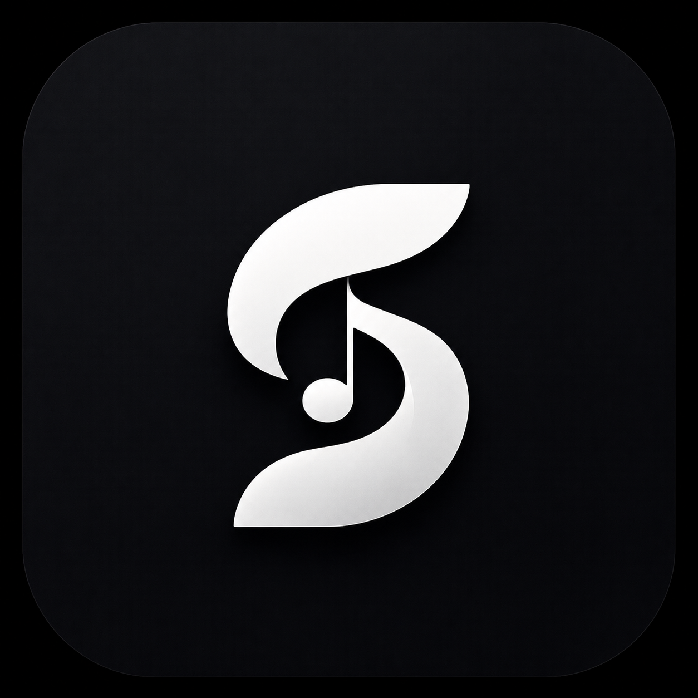
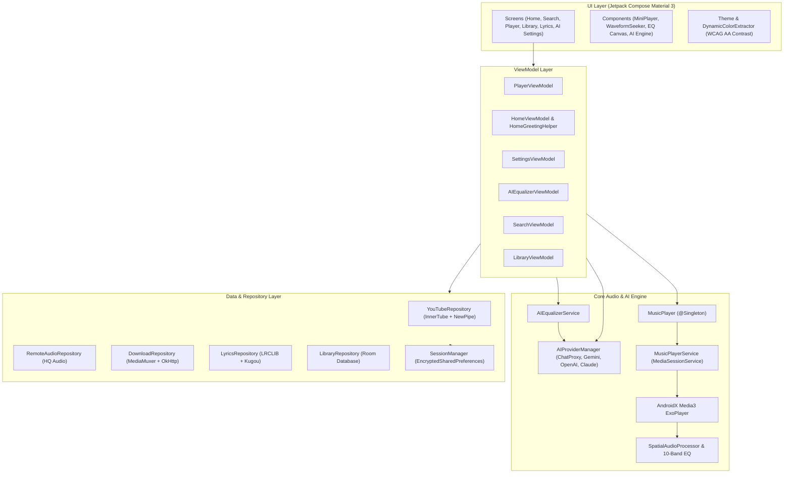

<div align="center">

  

  <h1>SONZA</h1>
  <h3>High-Fidelity Audiophile Music Player & AI-Powered Streaming Client</h3>

  <p>
    An ad-free, high-performance music application built for audiophiles and music lovers. Features bit-perfect sound reproduction, real-time 10-band DSP equalization, AI-driven audio profile tuning, multi-provider lyrics synchronization, context-aware mood discovery, binaural spatial audio, and social synchronized listening.
  </p>

  <p>
    <a href="https://github.com/princekjha-dev/Sonza/releases/latest"></a>
    <a href="https://github.com/princekjha-dev/Sonza/actions/workflows/build-apk.yml"></a>
    <a href="https://github.com/princekjha-dev/Sonza/stargazers"></a>
    <a href="https://github.com/princekjha-dev/Sonza/blob/main/LICENSE"></a>
    <a href="https://kotlinlang.org"></a>
    <a href="https://developer.android.com/jetpack/compose"></a>
  </p>

  <p>
    <a href="https://github.com/princekjha-dev/Sonza/releases/latest"><b>📥 Download Latest APK (v2.6.5.0)</b></a> •
    <a href="https://github.com/princekjha-dev/Sonza/releases"><b>📦 All Releases</b></a> •
    <a href="https://github.com/princekjha-dev/Sonza/issues"><b>🐛 Report Bug</b></a> •
    <a href="https://github.com/princekjha-dev/Sonza/discussions"><b>💬 Community & Discussions</b></a>
  </p>

</div>

---

## 📑 Contents

- [About Sonza](#-about-sonza)
- [Key Highlights & Features](#-key-highlights--features)
  - [AI Assistant & Neural Audio Engine](#-ai-assistant--neural-audio-engine)
  - [Context-Aware Mood & Discovery](#-context-aware-mood--discovery)
  - [Audiophile Audio & DSP Engine](#-audiophile-audio--dsp-engine)
  - [Multi-Source Synchronized Lyrics](#-multi-source-synchronized-lyrics)
  - [Discovery & Streaming](#-discovery--streaming)
  - [Smart Queue & Library Management](#-smart-queue--library-management)
  - [Offline Downloader & DASH Muxing](#-offline-downloader--dash-muxing)
- [Technical Architecture](#-technical-architecture)
- [Technology Stack](#-technology-stack)
- [Project Structure](#-project-structure)
- [Installation & Requirements](#-installation--requirements)
- [Building from Source](#-building-from-source)
- [Privacy & Security](#-privacy--security)
- [Third-Party Integrations](#-third-party-integrations)
- [Acknowledgments](#-acknowledgments)
- [Maintainer](#-maintainer)
- [License](#-license)
- [Disclaimer](#-disclaimer)

---

## 🎧 About Sonza

**Sonza** is an open-source Android music client and audiophile audio player built from the ground up to combine bit-perfect sound fidelity with modern, elegant design.

Unlike standard music players that compress audio or hide DSP metrics, Sonza offers:
- **Full Playback Transparency**: Live badges indicating real-time audio format (`Lossless FLAC • 24-bit/96kHz`, `Opus • 256kbps`, `HQ AAC • 320kbps`).
- **AI-Powered DSP Equalization**: Describe the soundstage you want in natural language, and Sonza translates your prompt into hardware-level parametric EQ curves, limiter thresholds, makeup gain, and spatial acoustic parameters.
- **Context-Aware Discovery**: Intelligent listening mood classification combining session taste vectors with time-of-day greetings and personalized recommendations.
- **Complete Privacy**: Zero ads, zero third-party telemetry, and hardware-encrypted local credential storage (`AES-256-GCM` via Android Keystore).

---

## ✨ Key Highlights & Features

### 🤖 AI Assistant & Neural Audio Engine
- **Multi-Provider AI Architecture**: Seamlessly switch between **Chat Proxy (Free, no key required)**, **Google Gemini**, **OpenAI (GPT-4o, o3-mini)**, and **Anthropic Claude (Claude 3.5 Sonnet)**.
- **Dynamic Model Catalogs**: Automatically discovers available models from provider APIs with support for "Random (Auto)" and automatic graceful fallback.
- **Natural Language Audio Tuning**: Generates hardware-level DSP configurations (10-band EQ gains, limiter threshold/ratio/attack/release, makeup gain, bass boost, and crossfeed) from user prompts (e.g., *"Make vocals crisp with deep sub-bass and wide studio spatialization"*).
- **A/B Comparison & Auto-AI Mode**: Instant real-time toggle between pre-AI and AI-optimized audio curves, with optional per-song auto-tuning.
- **Secure Key Management**: API keys are securely stored in `EncryptedSharedPreferences`, masked with visibility toggles, and verified with built-in live connection testing.

### 🌅 Context-Aware Mood & Discovery
- **Time + Mood Contextual Greetings**: Dynamic Home greeting adapting to your active listening mood (*Romantic ❤️*, *Sad/Emotional 💙*, *Energetic/Party 🔥*, *Chill/Lo-Fi 🎧*) across Morning, Afternoon, Evening, and Night windows.
- **Listening Taste Profile (20-Dimension Genre Vector)**: Locally computes genre affinity and session recency vectors to recommend songs tailored to your taste.
- **Spotlight Hero & Curated Shelves**: Editorial discovery rails featuring Daily Mixes, Quick Picks, Release Radar, Forgotten Favorites, and Artist Deep-Dives.
- **Spotify & Last.fm Integration**: Import public and private Spotify playlists with fuzzy matching, and scrobble tracks with Last.fm.

### 🎛️ Audiophile Audio & DSP Engine
- **Bit-Perfect Playback**: Native decoding for Lossless FLAC, WAV, ALAC, high-bitrate Opus (160–256 kbps), AAC (320 kbps), and MP3.
- **10-Band Parametric Equalizer**: `-12 dB` to `+12 dB` gain control across 31 Hz – 16 kHz with real-time interactive Bezier curve visualization, pre-amp gain, and studio presets.
- **Binaural Spatial Audio**: Acoustic simulations for `Natural`, `Wide`, `Cinema`, `Immersive`, and `Studio` soundstages.
- **Loudness Normalization**: ReplayGain RMS-based volume normalization with digital peak limiting to prevent distortion and audio clipping.
- **Seamless Crossfade**: Configurable constant-power crossfade (0 to 12 seconds) for gapless playback transitions.
- **Musical Haptics**: Rhythmic vibrational pulses synchronized with transients and low-frequency bass beats.

### 📜 Multi-Source Synchronized Lyrics
- **4-Stage Provider Fallback Cascade**: YouTube Music Synced Lyrics → LRCLIB API → Kugou API → Local `.lrc` files.
- **Word & Syllable Synchronization**: Smooth spring-animated auto-scrolling with current-line highlighting and interactive tap-to-seek.
- **Format & Export Tools**: Clean PDF lyrics document export with typography and album cover art.
- **Dynamic Palette Background**: Real-time fluid color extraction matching album artwork.

### 🌐 Discovery & Streaming
- **Hybrid Streaming Backend**: Pairs YouTube Music catalog metadata with 320 kbps high-quality audio streams.
- **Intelligent Dual-Debounced Search**: 250ms live suggestion search and 650ms deep catalog search across Songs, Albums, Artists, Playlists, and Music Videos.
- **SponsorBlock Integration**: Automatically skips non-music segments, intros, outros, and sponsor endorsements.
- **Integrated Video Player**: Seamless toggle between pure audio streaming and full-resolution (720p/1080p) video playback.

### 📚 Smart Queue & Library Management
- **Active Queue Control**: Drag-and-drop reordering, swipe-to-remove, active track equalizer animation, and multi-select batch actions.
- **Automix Radio**: Infinite autoplay continuation dynamically queuing related tracks upon queue completion.
- **Local & Cloud Playlists**: Create, rename, reorder, import from Spotify, or sync directly with authenticated YouTube Music accounts.
- **Device Media Scanning**: Scans and indexes local on-device audio files (`/storage/emulated/0/Music`).

### 💾 Offline Downloader & DASH Muxing
- **Dual-Stream DASH Muxing**: Downloads and muxes separate video and audio streams natively into standard `.mp4` video files via Android's `MediaMuxer` and `MediaExtractor`.
- **Audio Downloader**: High-bitrate audio caching with embedded ID3 metadata tags, lyrics, and high-resolution album cover art.
- **Cache Management**: In-app cache cleaner, download path inspector, and offline-first library mode.

---

## 🏛️ Technical Architecture

Sonza is built with **Clean Architecture**, **MVVM**, **Unidirectional Data Flow (UDF)**, and **Kotlin Coroutines / Flow**:



---

## 🛠️ Technology Stack

| Domain | Technology / Library | Version | Purpose |
| :--- | :--- | :--- | :--- |
| **Language** | [Kotlin](https://kotlinlang.org/) | `2.3.20` | Strict coroutines, serialization & multiplatform |
| **UI Framework** | [Jetpack Compose](https://developer.android.com/jetpack/compose) | `2026.03.01 (BOM)` | Declarative UI with Material 3 Expressive tokens |
| **Multiplatform** | [Compose Multiplatform](https://www.jetbrains.com/lp/compose-multiplatform/) | `1.7.3` | Shared desktop & common UI modules |
| **Audio Engine** | [AndroidX Media3](https://developer.android.com/media/media3) | `1.10.1` | `ExoPlayer`, `MediaSessionService`, `MediaMuxer` |
| **Dependency Injection** | [Koin](https://insert-koin.io/) / [Dagger Hilt](https://dagger.dev/hilt/) | `4.1.0` / `2.59.1` | Modular dependency injection & service lifecycle |
| **Local Database** | [Room Database](https://developer.android.com/training/data-storage/room) | `2.8.4` | Offline caching for songs, playlists, and history |
| **Secure Storage** | [EncryptedSharedPreferences](https://developer.android.com/topic/security/data) | `1.1.0` | AES-256-GCM hardware Keystore encryption for API keys & tokens |
| **Networking** | [OkHttp3](https://square.github.io/okhttp/) & [Ktor Client](https://ktor.io/) | `5.3.0` / `3.4.0` | HTTP/2, HTTP/3, Cronet & WebSocket client |
| **Image Loading** | [Coil 3](https://coil-kt.github.io/coil/) | `3.4.0` | Memory-efficient async image loading & palette generation |
| **Media Extractor** | [NewPipeExtractor](https://github.com/TeamNewPipe/NewPipeExtractor) | `v0.26.4` | Client-side media stream resolution |
| **Audio Tagging** | [JAudioTagger](https://www.jthink.net/jaudiotagger/) | `3.0.1` | ID3 metadata tag reading & writing |

---

## 📂 Project Structure

```text
Sonza/
├── app/                        # Main Android application module
│   ├── java/com/sonza/app/
│   │   ├── ai/                 # AIProviderManager, AIClients, AIEqualizerService
│   │   ├── data/               # SessionManager, AuthUtils, Repositories
│   │   ├── di/                 # Koin & Dagger Hilt dependency modules
│   │   ├── player/             # MusicPlayer engine, DSP & audio routing
│   │   ├── recommendation/     # TasteProfileBuilder, GenreTaxonomy, RecommendationEngine
│   │   ├── service/            # MusicPlayerService & DownloadService
│   │   └── ui/                 # Compose screens, components, theme & utils
│   └── res/                    # Drawables, layouts, mipmaps & strings
├── composeApp/                 # Compose Multiplatform shared UI modules
├── core/
│   ├── model/                  # Shared data models (Song, Playlist, PlayerState)
│   ├── data/                   # Data sources & storage implementations
│   ├── domain/                 # Repository abstractions & business logic
│   └── db/                     # Room database entities & DAOs
├── lyric-lrclib/               # LRCLIB synchronized lyrics client module
├── lyric-kugou/                # Kugou lyrics provider module
├── media-source/               # Remote audio streaming definitions
├── scrobbler/                  # Last.fm scrobbler integration module
├── updater/                    # In-app GitHub release update checker
├── gradle/                     # Gradle wrapper & version catalog (libs.versions.toml)
├── build.gradle.kts            # Root project build script
└── settings.gradle.kts         # Multi-module settings configuration
```

---

## 📲 Installation & Requirements

### Direct APK Download
1. Go to the [GitHub Releases](https://github.com/princekjha-dev/Sonza/releases/latest) page.
2. Download `Sonza-v2.6.5.0.apk` (or the latest release APK).
3. On your Android device, open the APK and tap **Install** (enable *"Install from Unknown Sources"* if prompted).

### System Requirements
- **Operating System**: Android 8.0 (API Level 26) or higher.
- **Architectures**: `arm64-v8a`, `armeabi-v7a`, `x86`, `x86_64`.
- **Storage**: ~75 MB free space.

---

## 🔨 Building from Source

### Prerequisites
- **JDK**: Java Development Kit 21 or higher.
- **Android Studio**: Android Studio Ladybug / Meerkat (2024.3+) or Android SDK Tools with API 35/36.
- **Git**: Installed and configured.

### Build Steps
```bash
# 1. Clone the repository
git clone https://github.com/princekjha-dev/Sonza.git
cd Sonza

# 2. Build Debug APK
./gradlew assembleDebug

# 3. Output Location
# The generated APK will be available at:
# app/build/outputs/apk/debug/app-debug.apk
```

---

## 🔒 Privacy & Security

- **No Third-Party Tracking**: Sonza does not bundle advertising SDKs, tracking frameworks, or behavioral analytics.
- **Encrypted Local Credentials & API Keys**: User credentials and AI API keys (Gemini, OpenAI, Anthropic) are stored strictly on-device in `EncryptedSharedPreferences` backed by the hardware Android Keystore (`AES-256-GCM`).
- **Direct Server Communication**: Authenticated requests communicate directly with official servers (`https://music.youtube.com`, `https://api.openai.com`, `https://generativelanguage.googleapis.com`, `https://api.anthropic.com`). No tokens or credentials are ever relayed through third-party servers.

---

## 🤝 Third-Party Integrations

| Service | Usage in Sonza | Mandatory |
| :--- | :--- | :--- |
| **YouTube Music (InnerTube)** | Search, recommendations, public charts, playlist browsing | Yes |
| **Chat Proxy** | Free AI assistant model proxy with dynamic catalog | Optional (Default) |
| **Google Gemini API** | Advanced AI audio tuning with Google AI models | Optional |
| **OpenAI API** | GPT-4o and o3-mini audio profile generation | Optional |
| **Anthropic Claude API** | Claude 3.5 Sonnet audio profile generation | Optional |
| **LRCLIB** | Synchronized lyrics fetching | Optional |
| **Kugou** | Fallback synchronized lyrics provider | Optional |
| **SponsorBlock** | Crowd-sourced music video segment skipping | Optional |
| **Last.fm** | Music scrobbling and personalized listening history | Optional |

---

## 💡 Acknowledgments

- [NewPipeExtractor](https://github.com/TeamNewPipe/NewPipeExtractor) — Lightweight media extraction library.
- [ExoPlayer / Media3](https://github.com/androidx/media) — Android's reference media playback infrastructure.
- [LRCLIB](https://lrclib.net/) — Open-source synchronized lyrics repository.
- [Coil](https://github.com/coil-kt/coil) — Kotlin-first asynchronous image loading library.

---

## 👨‍💻 Maintainer

- **Developer**: **Prince Kumar Jha**
- **GitHub**: [@princekjha-dev](https://github.com/princekjha-dev)
- **Repository**: [princekjha-dev/Sonza](https://github.com/princekjha-dev/Sonza)

---

## 📄 License

Sonza is open-source software licensed under the [GNU General Public License v3.0 (GPL-3.0)](LICENSE).

---

## ⚖️ Disclaimer

Sonza is an independent open-source project and is not affiliated with, endorsed by, or sponsored by Google LLC, YouTube, OpenAI, Anthropic, or Spotify. All trademarks, service marks, and company names are the property of their respective owners.
