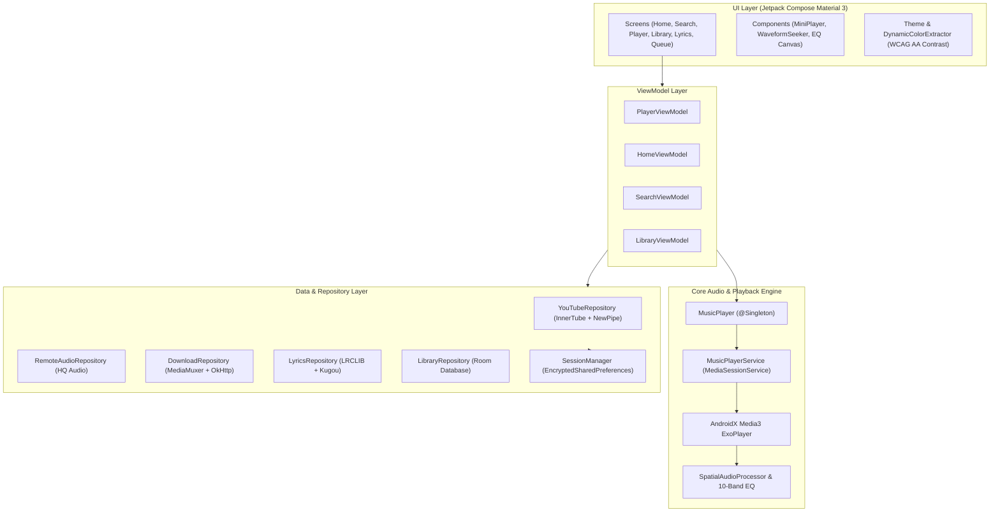

<div align="center">

  

  <h1>SONZA</h1>
  <h3>High-Fidelity Audiophile Music Player & Streaming Client for Android</h3>

  <p>
    An ad-free, high-performance music application built for audiophiles who demand bit-perfect sound reproduction, real-time DSP equalization, synchronized lyrics, binaural spatial audio, and social synchronized listening.
  </p>

  <p>
    <a href="https://github.com/princekjha-dev/Sonza/releases/latest"></a>
    <a href="https://github.com/princekjha-dev/Sonza/actions/workflows/build-apk.yml"></a>
    <a href="https://github.com/princekjha-dev/Sonza/stargazers"></a>
    <a href="https://github.com/princekjha-dev/Sonza/blob/main/LICENSE"></a>
    <a href="https://kotlinlang.org"></a>
    <a href="https://developer.android.com/jetpack/compose"></a>
  </p>

  <p>
    <a href="https://github.com/princekjha-dev/Sonza/releases/latest"><b>📥 Download Latest APK</b></a> •
    <a href="https://github.com/princekjha-dev/Sonza/releases"><b>📦 All Releases</b></a> •
    <a href="https://github.com/princekjha-dev/Sonza/issues"><b>🐛 Report Bug</b></a> •
    <a href="https://github.com/princekjha-dev/Sonza/discussions"><b>💬 Discussions</b></a>
  </p>

</div>

---

## 📑 Contents

- [About Sonza](#-about-sonza)
- [Key Features](#-key-features)
  - [Audiophile Audio & DSP](#-audiophile-audio--dsp)
  - [Discovery & Streaming](#-discovery--streaming)
  - [Synchronized Lyrics Engine](#-synchronized-lyrics-engine)
  - [Smart Queue & Library](#-smart-queue--library)
  - [Offline & Downloader](#-offline--downloader)
- [Technical Architecture](#-technical-architecture)
- [Technology Stack](#-technology-stack)
- [Project Structure](#-project-structure)
- [Installation](#-installation)
- [Building from Source](#-building-from-source)
- [Privacy & Security](#-privacy--security)
- [Third-Party Services](#-third-party-services)
- [Acknowledgments](#-acknowledgments)
- [Maintainer](#-maintainer)
- [License](#-license)
- [Disclaimer](#-disclaimer)

---

## 🎧 About Sonza

**Sonza** is a native Android music client designed from the ground up to combine the depth of an open-source audiophile player with the ease and fluidity of modern streaming interfaces.

Unlike conventional players that compress streams or obscure audio processing details, Sonza exposes technical playback metrics in real time (**Lossless FLAC, 24-bit/96kHz, 320 kbps Opus/AAC**), incorporates a studio-grade **10-Band Parametric Equalizer** with real-time DSP Bezier curve rendering, and applies **ReplayGain volume normalization** with anti-clipping limiters.

Sonza also provides synchronized word-level lyrics, low-latency social listening rooms, YouTube Music browse feeds, and full offline caching—all encased in a dynamic, Material 3 Expressive UI.

---

## ✨ Key Features

### 🎛️ Audiophile Audio & DSP
- **Bit-Perfect Playback**: Support for Lossless FLAC, WAV, ALAC, high-bitrate Opus (160–256 kbps), AAC (320 kbps), and MP3.
- **Real-Time Format Disclosure**: Live audio codec, bitrate, and sample-rate badge (`FLAC • 24-bit/96kHz`, `OPUS • 256kbps`, `HQ • 320kbps`).
- **10-Band Parametric Equalizer**: `-12 dB` to `+12 dB` gain control across 31 Hz – 16 kHz with interactive Bezier curve visualization, pre-amp gain, and studio presets.
- **Binaural Spatial Audio**: Immersive acoustic simulations (`Natural`, `Wide`, `Cinema`, `Immersive`, `Studio`).
- **Loudness Normalization**: ReplayGain RMS-based volume normalization with digital peak limiting to eliminate audio clipping.
- **Constant-Power Crossfade**: Configurable seamless gapless transitions (0 to 12 seconds).
- **Pitch & Speed Control**: Independent pitch adjustment and tempo stretching from `0.25x` to `3.0x`.
- **Musical Haptics**: Transient-detected vibrational accents synchronized to rhythm and bass beats.

### 🌐 Discovery & Streaming
- **Hybrid Streaming Backend**: Seamlessly pairs YouTube Music catalog metadata with 320 kbps high-quality audio streams.
- **Dynamic Home Surfaces**: Personalized shelves (Quick Picks, Daily Recommendations, Trending Music, Popular Artists, and Mood Mixes).
- **Intelligent Search**: Dual-debounced global search (250ms live suggestions, 650ms deep catalog search) across Songs, Albums, Artists, Playlists, and Music Videos.
- **SponsorBlock Integration**: Automatically detects and skips non-music segments, intros, outros, and sponsor endorsements.
- **Integrated Video Player**: Seamless toggle between pure audio streaming and full-resolution (720p/1080p) video playback.

### 📜 Synchronized Lyrics Engine
- **Multi-Provider Fallback Cascade**: Primary YouTube Music Synced Lyrics → LRCLIB API → Kugou API → Local `.lrc` files.
- **Word & Line Synchronization**: Smooth spring-animated auto-scrolling with current-line highlighting.
- **Interactive Seek**: Tap any lyrics line to immediately seek playback to that timestamp.
- **PDF Export**: Generate formatted lyrics PDF documents with custom typography and album artwork.
- **Dynamic Backdrop**: Real-time fluid color extraction matching album artwork palettes.

### 📚 Smart Queue & Library
- **Active Queue Management**: Drag-and-drop reordering, swipe-to-remove, active track equalizer animation, and multi-select batch actions.
- **Automix Radio**: Infinite autoplay continuation dynamically queuing related music upon playlist completion.
- **Local & Cloud Playlists**: Create, rename, reorder, import from Spotify via fuzzy matching, or sync with authenticated YouTube Music accounts.
- **MediaStore Integration**: Automatic scanning and indexing of on-device audio files (`/storage/emulated/0/Music`).

### 💾 Offline & Downloader
- **Dual-Stream DASH Muxing**: Downloads and muxes separate video and audio streams natively into standard `.mp4` video files via Android's `MediaMuxer` and `MediaExtractor`.
- **Audio Downloader**: High-bitrate audio caching with embedded ID3 metadata tags, lyrics, and high-resolution album cover art.
- **Storage Management**: In-app cache cleaner, download path inspector, and offline-first library browsing.

---

## 🏛️ Technical Architecture

Sonza follows modern Android architectural best practices with **Clean Architecture**, **MVVM**, **Unidirectional Data Flow (UDF)**, and **Kotlin Coroutines / Flow**:



---

## 🛠️ Technology Stack

| Domain | Technology / Library | Version | Purpose |
| :--- | :--- | :--- | :--- |
| **Language** | [Kotlin](https://kotlinlang.org/) | `2.3.0` | Primary language with strict coroutines & serialization |
| **UI Framework** | [Jetpack Compose](https://developer.android.com/jetpack/compose) | `2026.03.01 (BOM)` | Modern declarative UI with Material 3 Expressive |
| **Audio Engine** | [AndroidX Media3](https://developer.android.com/media/media3) | `1.10.1` | `ExoPlayer`, `MediaSessionService`, `MediaMuxer` |
| **Dependency Injection** | [Dagger Hilt](https://dagger.dev/hilt/) / [Koin](https://insert-koin.io/) | `2.59.1` / `4.1.0` | Modular dependency injection |
| **Local Database** | [Room Database](https://developer.android.com/training/data-storage/room) | `2.8.4` | Offline caching for songs, playlists, and history |
| **Secure Storage** | [EncryptedSharedPreferences](https://developer.android.com/topic/security/data) | `1.1.0` | AES-256-GCM hardware Keystore encryption for auth tokens |
| **Networking** | [OkHttp3](https://square.github.io/okhttp/) & [Ktor Client](https://ktor.io/) | `5.3.0` / `3.4.0` | HTTP/2, HTTP/3, Cronet & WebSocket client |
| **Image Loading** | [Coil 3](https://coil-kt.github.io/coil/) | `3.4.0` | Memory-efficient async image loading & palette generation |
| **Extractor** | [NewPipeExtractor](https://github.com/TeamNewPipe/NewPipeExtractor) | `v0.26.4` | Client-side media stream resolution |
| **Audio Tagging** | [JAudioTagger](https://www.jthink.net/jaudiotagger/) | `3.0.1` | Reading/writing ID3 tags on downloaded files |

---

## 📂 Project Structure

```text
Sonza/
├── app/                        # Main Android application module
│   ├── java/com/sonza/app/
│   │   ├── data/               # SessionManager, AuthUtils, Repositories
│   │   ├── di/                 # Dagger Hilt & Koin dependency modules
│   │   ├── player/             # MusicPlayer engine, DSP & audio routing
│   │   ├── providers/          # Lyrics & metadata extraction providers
│   │   ├── service/            # MusicPlayerService & DownloadService
│   │   └── ui/                 # Jetpack Compose screens, components & themes
│   └── res/                    # Drawables, layouts, mipmaps & strings
├── composeApp/                 # Compose Multiplatform shared UI modules
├── core/
│   ├── model/                  # Shared data models (Song, Playlist, PlayerState)
│   ├── data/                   # Data sources & storage implementations
│   ├── domain/                 # Repository abstractions & business logic
│   └── db/                     # Database entities & DAOs
├── lyric-lrclib/               # LRCLIB synchronized lyrics client module
├── lyric-kugou/                # Kugou lyrics provider module
├── media-source/               # Remote audio streaming definitions
├── scrobbler/                  # Last.fm scrobbler integration module
├── updater/                    # In-app GitHub release update checker
├── server/                     # Core algorithmic verification suite
│   └── verify_algorithms.py
├── gradle/                     # Gradle wrapper & version catalog (libs.versions.toml)
├── build.gradle.kts            # Root project build script
└── settings.gradle.kts         # Multi-module settings configuration
```

---

## 📲 Installation

### Direct APK Download
1. Head over to the [GitHub Releases](https://github.com/princekjha-dev/Sonza/releases) page.
2. Download `Sonza-v2.6.4.0.apk` (or latest release APK) from the latest release.
3. On your Android device, open the downloaded APK and tap **Install** (enable *"Install from Unknown Sources"* if prompted).

### Requirements
- **Operating System**: Android 8.0 (API Level 26) or higher.
- **Architectures**: `arm64-v8a`, `armeabi-v7a`, `x86`, `x86_64`.
- **Storage**: ~50 MB free space.

---

## 🔨 Building from Source

### Prerequisites
- **JDK**: Java Development Kit 21 or higher.
- **Android Studio**: Android Studio Ladybug / Meerkat (2024.3+) or Android SDK Tools with API 35/37.
- **Git**: Installed and configured.

### Build Steps
```bash
# 1. Clone the repository
git clone https://github.com/princekjha-dev/Sonza.git
cd Sonza

# 2. Build Debug APK
./gradlew assembleDebug

# 3. Output Location
# The generated APK will be available at:
# app/build/outputs/apk/debug/Sonza-v2.6.4.0.apk (or app/build/outputs/apk/debug/Sonza-v2.6.5.0.apk)
```


---

## 🔒 Privacy & Security

- **No Third-Party Tracking**: Sonza does not bundle advertising SDKs, tracking frameworks, or third-party behavioral analytics.
- **Encrypted Local Credentials**: When logging into a Google / YouTube account, session cookies (`SAPISID`, `__Secure-3PAPISID`) are stored strictly on-device using Android's `EncryptedSharedPreferences` backed by the hardware Android Keystore (`AES-256-GCM`).
- **Direct Communication**: Authenticated requests communicate exclusively with official Google/YouTube servers (`https://music.youtube.com/youtubei/v1/*`). No credentials or tokens are ever relayed to third-party endpoints.

---

## 🤝 Third-Party Services

| Service | Usage in Sonza | Mandatory |
| :--- | :--- | :--- |
| **YouTube Music (InnerTube)** | Search, recommendations, public charts, playlist browsing | Yes |
| **LRCLIB** | Synchronized lyrics fetching | Optional |
| **Kugou** | Fallback synchronized lyrics provider | Optional |
| **SponsorBlock** | Crowd-sourced music video segment skipping | Optional |
| **Last.fm** | Music scrobbling and personalized listening history | Optional |

---

## 💡 Acknowledgments

- [NewPipeExtractor](https://github.com/TeamNewPipe/NewPipeExtractor) — Lightweight media extraction library.
- [ExoPlayer / Media3](https://github.com/androidx/media) — Android's reference media playback infrastructure.
- [LRCLIB](https://lrclib.net/) — Open-source synchronized lyrics repository.
- [Coil](https://github.com/coil-kt/coil) — Kotlin-first asynchronous image loading library.

---

## 👨‍💻 Maintainer

- **Developer**: **Prince Kumar Jha**
- **GitHub**: [@princekjha-dev](https://github.com/princekjha-dev)
- **Repository**: [princekjha-dev/Sonza](https://github.com/princekjha-dev/Sonza)

---

## 📄 License

Sonza is open-source software licensed under the [GNU General Public License v3.0 (GPL-3.0)](LICENSE).

---

## ⚖️ Disclaimer

Sonza is an independent open-source project and is not affiliated with, endorsed by, or sponsored by Google LLC, YouTube, or Spotify. All trademarks, service marks, and company names are the property of their respective owners.
